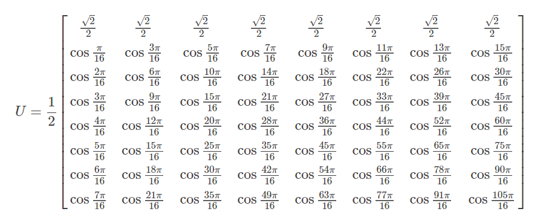
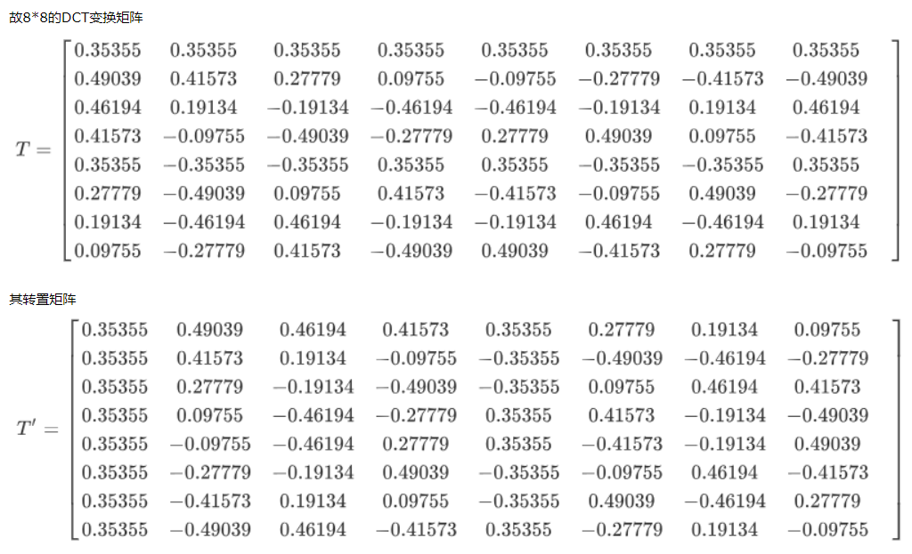
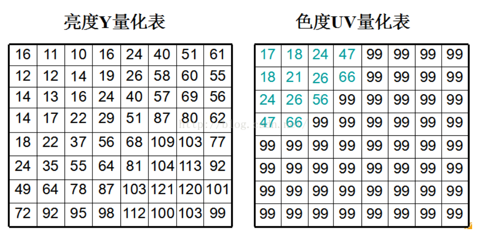

## JPEG压缩流程

&emsp;&emsp;JPEG压缩，全称(Joint Photographic Experts Group， 联合图像专家小组)，是一种有损压缩 (有损lossy，无损压缩: lossless)，目前广为使用的压缩方法除JPEG压缩以外还有JPEG2000、BPG等压缩算法，其中JPEG是基于DCT (Discrete Cosine Transform, 离散余弦变化)的，而JPEG2000是基于DWT (Discrete Wavelet Transform) 实现的，从压缩比来看，性能从高到低：BPG > JPEG2000 > JPEG。 (毕竟JPEG提出来的最早，JPEG2000次之，BPG最晚，新提出来的东西肯定要突破旧的才行)。

​		JPEG压缩主要有以下几步：(1) 颜色空间变换; (2) 图像裁剪; (3) 二维DCT变换; (4) 量化; (5) 编码。

​		对所有的编码压缩算法而言，变换、量化、编码、解码、逆量化、逆变换这6个步骤几乎是通用的，(基于深度学习的图像压缩不清楚，目前不了解)。

#### 1. 颜色空间变换

​		将图像由原始的**RGB**颜色空间转换为**YCbCr**颜色空间，其中Y表示亮度，C表示Color色度，Cb表示蓝色色度、Cr表示红色色度。这里值得一提的是：人眼对图像中低频部分的敏感度要高于高频部分的敏感度；对亮度的敏感度相对于色度的敏感度要更高；在RGB三色通道中，人眼对于Blue蓝色通道的敏感度最低。

​		RGB和YCbCr颜色通道转换公式如下：

```
Y =  0.299R + 0.587G + 0.114B
U = -0.169R - 0.331G + 0.500B + 128
V =  0.500R - 0.419G - 0.081B + 128
```

#### 2. 采样

​		由于人眼对于亮度和色度的敏感度不一样，因此在采样时也采用不同的采样比例，比较常见的采样比例是：YUV422或者YUV411，其含义为：一个2x2大小的块中，Y分量采样四次，而UV分量采样1到2次 （所以是不是假设原先图像的大小是[3, H, W]，采样之后通道数还是3，Y通道的图像大小不变，而UV通道的图像变小，YUV411大小变为原来的1/4, YUV422的话，H或者W其中之一变为原来的一半，另一半保持不变）这一部分后续需要验证。

#### 3. 分割

​		将原图像分割为若干8x8大小的块，这就要求图像的大小是8的整数倍，若不是整数倍则对原图进行加0填充（也由文章说原图大小需要是16的整数倍，好像是因为UV通道采样的缘故）这一部分也需要后续验证。

#### 4. 二维DCT变换

​		JPEG图像压缩是基于DCT离散余弦变换实现的，其具体操作实际上就是矩阵乘法，DCT变换中有一个8x8大小的DCT矩阵，记作T，矩阵如下所示：



​		观察U发现：从上到下，从左到右，cosine()函数的频率越来越大，实数形式的U矩阵和其转置矩阵transpose Array如下：



​		经过$Y = T*A*T^{'}$计算之后即可得到DCT变化之后的结果，DCT作为傅立叶变换的一种，其作用也是实现空域到频域的转变，将原本空间分布的像素点转变为若干余弦函数的组合，最终得到的DCT变换后的结果（DCT系数矩阵）其本质就是这些consine函数的权重。DCT变换之后低频部分集中在矩阵的左上角、高频部分集中在矩阵的右下角，低频部分的值较大，高频部分的值较小，约等于0。

​		DCT变换公式如下所示：(鬼看的懂。。。。)
$$
F(u, v) = C(u, v)\sum_{x=0}^{N-1}\sum_{y=0}^{N-1}f(x, y)cos\frac{\pi u(2x+1)}{2N}cos\frac{\pi v(2y+1)}{2N}
$$
​		其中$C(x, y)$ 的表达式如下：
$$
C(x, y) = \left\{
\begin{aligned}
\frac{1}{N} &&{(x, y) == (0,0)}\\ 
\frac{1}{2N}&&{(x, y) != (0,0)}
\end{aligned}
\right.
$$
​		DCT变换矩阵计算公式为：
$$
T_{ij} = \left\{
\begin{aligned}
\frac{1}{\sqrt{M}} && i =0, 0\leq j \leq M-1 \\
\sqrt{\frac{2}{M}}cos\frac{\pi (2j+1)i}{2M} && 1 \leq i \leq M - 1, 0\leq j \leq M-1
\end{aligned}
\right.
$$

#### 5. 量化

​		量化操作其实就是矩阵对应位置的值相除，量化是导致JPEG有损压缩的根源，到DCT变换这一步，操作依旧是可逆的，但是到了量化这一步，由于存在信息损失，所以就不可逆，也就无法恢复至和原始图像一模一样。

​		JPEG中有两张8x8大小的量化表，一张是针对Y通道的、另一张是针对UV色度通道的，量化表的形式如下所示：



​		**将DCT变换后所得8x8大小的array除以量化表，小数部分四舍五入，就得到量化之后的结果**。由于人眼对亮度相比于色度更敏感，所以**对亮度Y进行细量化，对UV进行粗量化**，因此Y量化表中的值相较于UV量化表就小一些。	

​		此外，观察量化表可知，表中左上角对应低频部分的值都较小，右下角对应高频部分的值较大，这样相除之后，DCT系数矩阵左上角的值受影响较小，右下角的值受影响较大几乎都变为了0，从而实现保留低频信息，去除高频信息的任务。量化之后array中大部分的值都变为了0，这对后续压缩父非常有益。

​	（个人理解：DCT变换是实现从空域到频域的转变，同时将低频和高频部分区分开，而量化的主要作用是去除图像中的高频部分）

​		在JPEG压缩中压缩质量因子 quality factor，通过影响量化表，实现不同强度的JPEG压缩，这其中存在一个mapping映射关系，输入为质量因子和原始量化表，输出为变换后的量化表。

#### 6. 编码

​		量化之后的8x8矩阵进行编码，对于DC直流分量，由于相邻8x8大小块的DC直流分量比较相差不大，于是采样差分编码 (DPCM)。 而剩下的63个AC交流分量经过ZigZag的Z字形扫描排序（没有按照按行存储，而是采用Z字形存储，这样可以保证在存储空间相邻的信息，在图像中也可以相邻），之后采用Running Length Encode 游程长度编码。

​		直流DC分量和交流AC分量分别编码之后，再采用Huffman编码进行压缩，这里需要采用4张不同的Huffman表，亮度通道Y和色度通道C各自对应一个Huffman表，然后直流分量和交流分量分别对应一个表。

​		(说实话，这里关于编码这一块，只是知道是这么回事，但是编码具体是怎么做的还是不太会)		


参考文献：

[https://www.cnblogs.com/buaaxhzh/p/9138307.html](https://www.cnblogs.com/buaaxhzh/p/9138307.html)

[https://blog.csdn.net/nemoyy/article/details/80896449?utm_medium=distribute.pc_relevant.none-task-blog-2%7Edefault%7EBlogCommendFromBaidu%7Edefault-6.searchformbaiduhighlight&depth_1-utm_source=distribute.pc_relevant.none-task-blog-2%7Edefault%7EBlogCommendFromBaidu%7Edefault-6.searchformbaiduhighlight](https://blog.csdn.net/nemoyy/article/details/80896449?utm_medium=distribute.pc_relevant.none-task-blog-2%7Edefault%7EBlogCommendFromBaidu%7Edefault-6.searchformbaiduhighlight&depth_1-utm_source=distribute.pc_relevant.none-task-blog-2%7Edefault%7EBlogCommendFromBaidu%7Edefault-6.searchformbaiduhighlight)

[https://blog.csdn.net/newchenxf/article/details/51719597?utm_medium=distribute.pc_relevant.none-task-blog-2%7Edefault%7EsearchFromBaidu%7Edefault-2.searchformbaiduhighlight&depth_1-utm_source=distribute.pc_relevant.none-task-blog-2%7Edefault%7EsearchFromBaidu%7Edefault-2.searchformbaiduhighlight](https://blog.csdn.net/newchenxf/article/details/51719597?utm_medium=distribute.pc_relevant.none-task-blog-2%7Edefault%7EsearchFromBaidu%7Edefault-2.searchformbaiduhighlight&depth_1-utm_source=distribute.pc_relevant.none-task-blog-2%7Edefault%7EsearchFromBaidu%7Edefault-2.searchformbaiduhighlight)

[https://blog.csdn.net/zhiyuan2021/article/details/106394613?utm_medium=distribute.pc_relevant.none-task-blog-2~default~baidujs_title~default-0.searchformbaiduhighlight&spm=1001.2101.3001.4242](https://blog.csdn.net/zhiyuan2021/article/details/106394613?utm_medium=distribute.pc_relevant.none-task-blog-2~default~baidujs_title~default-0.searchformbaiduhighlight&spm=1001.2101.3001.4242)

